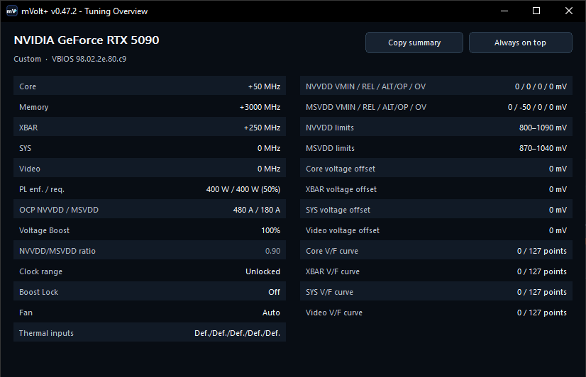

# mVolt+

mVolt+ is a Windows tool for NVIDIA GPU tuning and monitoring. It supports
voltage-limit and clock offsets, power limits, V/F and fan curves, and saved
profiles.

It primarily targets RTX 50 series GPUs. Support for earlier GeForce generations
is experimental; available controls depend on the GPU, VBIOS and driver.

**[Download releases](https://github.com/b00nz/mVolt/releases/latest)** ·
**[User guide](docs/guide.md)** ·
**[Upgrading from v0.38](docs/guide.md#upgrading-old-profiles)** ·
**[Report an issue](https://github.com/b00nz/mVolt/issues)**

This README and the guide describe **v0.39**. Check the release page for the
version of the downloadable build.


*Live screenshots from v0.39 on an RTX 5090. The values shown are not recommended
tuning settings.*

## Start here

| I want to… | Read this |
| --- | --- |
| Understand Enabled, Target, Applied and Reset | [How the dashboard works](docs/guide.md#how-the-dashboard-works) |
| Learn what every tile does | [Dashboard control reference](docs/guide.md#dashboard-control-reference) |
| Understand VMIN, REL, ALT, OV and effective maximum | [Voltage limits and measured voltage](docs/guide.md#voltage-limits-and-measured-voltage) |
| Edit a V/F curve | [V/F Curve Editor](docs/guide.md#vf-curve-editor) |
| Choose fixed fans, a fan curve or firmware control | [Fan control and persistence](docs/guide.md#fan-control-and-persistence) |
| Save, apply or automate profiles | [Profiles](docs/guide.md#profiles) · [Startup and tray](docs/guide.md#startup-and-tray) |
| Find out what is limiting boost | [Telemetry](docs/guide.md#telemetry) |
| Fix a confusing reading or behavior | [Troubleshooting](docs/guide.md#troubleshooting) |

## What changed in v0.39

- Replaced absolute voltage-range sliders with VMIN, REL, ALT and supported OV
  offsets. REL and ALT can be edited together or separately.
- Rebuilt the dashboard with enable switches, Quick tuning pins, collapsible
  sections, themes, tooltips and a two-column Overview.
- Added hotspot where supported, firmware clock history, boost-limit reasons
  and timelines, more rail readings, memory pressure and PCIe traffic.
- Profiles now distinguish applying saved-enabled settings from restoring a
  full snapshot, including captured disabled settings.
- Added software fan curves and one Apply action for shared or individual fan targets.
- Added immediate Reset, live slider target updates and V/F undo/redo.
- Fixed power and profile application, startup, recovery, scaling and repainting.

## Quick start

1. Download the executable or ZIP from [Releases](https://github.com/b00nz/mVolt/releases/latest).
2. Confirm the selected GPU in the header. Open **Telemetry** to inspect its
   readings, or launch with `--read-only` to explore with tuning writes disabled.
3. Enable a control you want mVolt+ to manage, then adjust its target. Slider and
   input edits stay pending. Use **Review…**, then **Apply changes**.
4. Once you have checked the result under your own workloads, use
   **Profiles → Save current settings as…** to save the configuration.

<details>
<summary><strong>Which actions change the GPU immediately?</strong></summary>

| Action | What happens |
| --- | --- |
| Move a slider, type a target, edit curve points | Stages an edit; does not apply it |
| Enable or disable a dashboard tile | Chooses whether Apply includes it; disabling leaves the applied value in place |
| Apply changes / Reapply enabled | Writes enabled dashboard targets |
| Apply fans | Writes the fan tile's pending targets in one step |
| Reset / Reset all | Immediately applies the relevant defaults; no second Apply |
| Boost lock | Immediately toggles boost performance mode |
| Discard pending | Restores editing targets from readback; does not reset hardware |

Turning off advanced ranges can also apply narrower limits.
See [Advanced tuning](docs/guide.md#advanced-tuning).

</details>

## How profiles work

Profiles belong to the selected GPU and VBIOS. They use the Enabled/Disabled
switches **saved in the profile**, regardless of the dashboard's current switches.

| Mode | What applying the profile does |
| --- | --- |
| **Normal** (default) | Applies saved-enabled settings, including zero or stock values. Saved-disabled and absent settings stay untouched. |
| **Full snapshot** (opt-in when saving) | Restores captured settings, including disabled ones. When saving, enabled controls use their targets, including pending edits; disabled controls use GPU readback. Absent settings stay untouched. |

Saving does not apply anything; **Load for editing** stages the saved targets.
**Apply profile**, a header profile selection or a profile shortcut applies
immediately. See [Profiles](docs/guide.md#profiles) for the actions and
[Startup and tray](docs/guide.md#startup-and-tray) for logon setup.

## Upgrading old profiles

v0.39 can read supported older profiles. If a profile contains **enabled old
NVVDD/MSVDD voltage ranges**, choose **Load for editing**, review and adjust the
new voltage offsets, then save it again. Old absolute voltage targets are not
converted automatically.

Check the saved Enabled/Disabled switches before applying. Keep a copy of
`%LOCALAPPDATA%\mVolt+` if you might return to v0.38.
[More about profile compatibility](docs/guide.md#upgrading-old-profiles).

## Controls and monitoring

| Area | Available functions |
| --- | --- |
| NVVDD / Core | Core rail limits, core voltage demand, core clock offset, GPU clock range and NVVDD OCP |
| MSVDD / Fabric | Fabric rail limits, XBAR/SYS/video voltage demands and clocks, MSVDD OCP |
| Memory / VRAM | Memory clock offset |
| Power / Boost / Cooling | Board power limit, Voltage Boost, bidirectional core/fabric clock propagation ratio and fan duties |
| Curve editors | Core V/F points, region editing, Flatten above, undo/redo and temperature-based fan control |
| Telemetry | Rails/ADCs, clocks, power, P-states, temperatures, boost limits, memory pressure and PCIe |
| Overview | All current settings in two columns, profile/VBIOS identity, Copy summary and Always on top |
| Profiles and preferences | Per-GPU/VBIOS profiles, full snapshots, shortcuts, logon application, RTSS overlay, scaling and themes |

## What stays applied after closing?

Applied clocks, rail offsets, power/current limits, V/F edits, locks and fixed
fan duty are not reverted when mVolt+ exits. The driver can clear settings on
a reset or reboot; configured startup and recovery handle reapplication.

**A software fan curve needs mVolt+ running to keep following temperature.**
The tray is sufficient. Fully exiting leaves the last fan duty fixed;
**Reset to auto** returns temperature control to the GPU firmware.

GPU tuning can cause instability or hardware damage. An accepted setting is
not proof of stability, and a reported device limit is not a safe-voltage rating.

## Command line

```powershell
.\mVolt+.exe --help | Out-Host
.\mVolt+.exe --list-gpus | Out-Host
.\mVolt+.exe --status | Out-Host
.\mVolt+.exe --read-only
```

Direct CLI tuning is applied immediately. Rail options now use
`--nvvdd-offsets VMIN,REL,ALT[,OV]` and `--msvdd-offsets VMIN,REL,ALT[,OV]`.
[CLI reference and automation](docs/guide.md#command-line-and-automation).

## More screenshots

<details>
<summary>Telemetry, V/F editing, Profiles and Overview</summary>




</details>

## Requirements and project information

- 64-bit Windows and an NVIDIA display driver.
- Administrator privileges for tuning; read-only commands do not require elevation.
- Working NVML support for GPU clock-range control and relevant NVML telemetry.
- RivaTuner Statistics Server only if you want its on-screen overlay.

Experimental support covers RTX 40 / Ada, RTX 30 / Ampere, RTX 20 / Turing and
GTX 10 / Pascal. Support is checked per control and sensor; some monitoring
features have narrower requirements.
[Compatibility details](docs/guide.md#compatibility-and-multiple-gpus).

mVolt+ is an independent third-party project. It is not affiliated with,
sponsored by, approved by, or endorsed by NVIDIA Corporation. NVIDIA, GeForce,
RTX and related product names belong to their respective owners.

Thanks to [Loong0x00](https://github.com/Loong0x00) for discovering the XBAR clock control.
