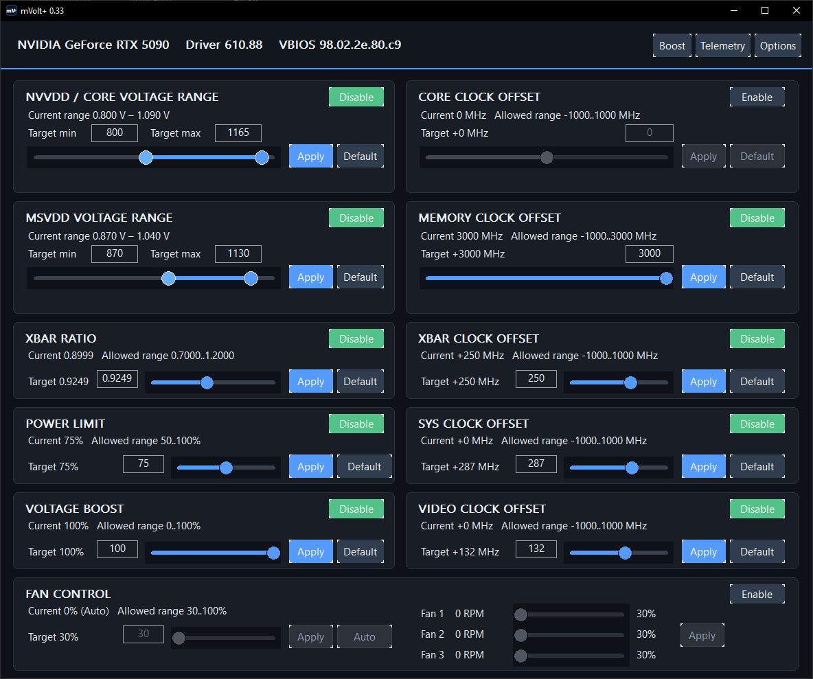
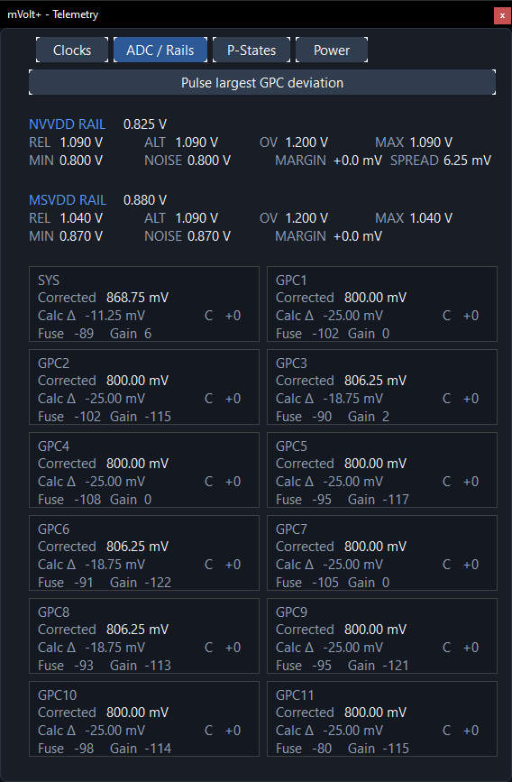
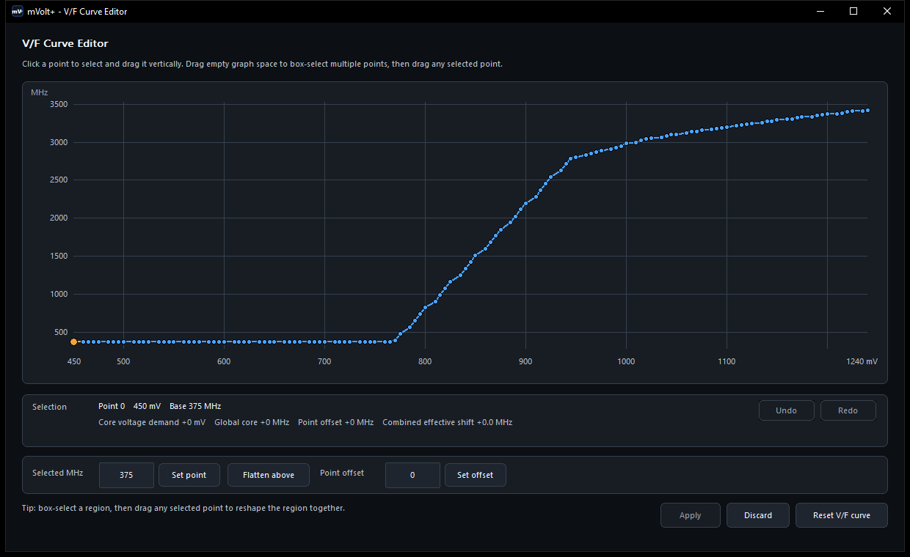
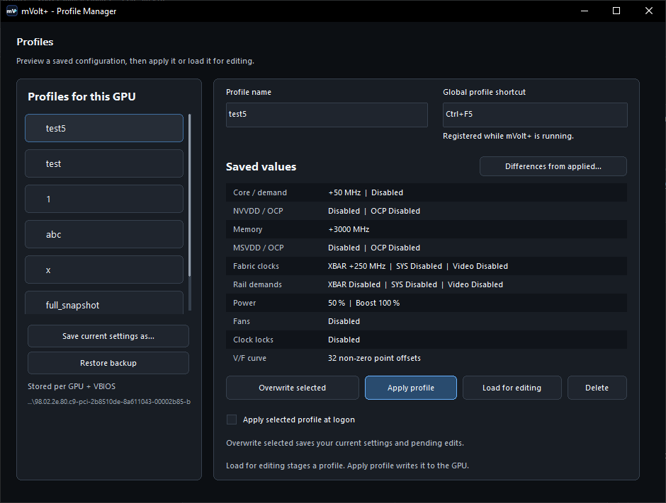

# mVolt+

Windows tuning utility for Blackwell GPUs.

## Download

Download the latest `mVolt+.exe` from [GitHub Releases](../../releases/latest) 
or click here: [mVolt+.exe](https://github.com/b00nz/mVolt/releases/download/v0.33/mVolt+.exe)

Current release: **0.33**

## Features

- NVVDD/MSVDD minimum and maximum voltage control
- XBAR clock control and adjustable GPC-to-XBAR propagation ratio
- Core, memory, SYS and video clock offsets
- Power limit and Voltage Boost
- Linked and per-fan control with live RPM monitoring
- V/F curve editing with regional offsets and flattening
- Named tuning profiles for every control, with full-setting restore and
  optional automatic application at Windows logon
- Multi-GPU selection with per-GPU profiles and startup settings
- Live clock, rail, ADC, power and P-state telemetry in separate tabs
- Command-line status, tuning and profile application

## Compatibility

Tested on GeForce RTX 5090, RTX 5080, and RTX 5070 Ti.

## Screenshots

Administrator privileges are required. Hardware support varies by GPU,
driver, and VBIOS. GPU tuning can cause crashes or hardware damage; use it
at your own risk.

mVolt+ is not affiliated with or endorsed by any GPU manufacturer.

## Credits

- [Loong0x00](https://github.com/Loong0x00) for discovering the XBAR clock
  control.
